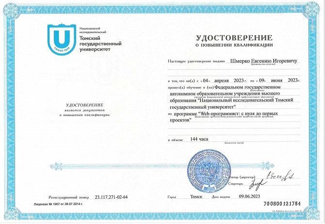
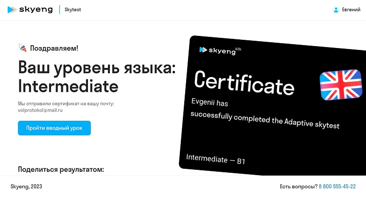

# Evgenii Shmerko
### Frontend Developer
---
## Contact information:
**Phone:** +7 902 652 82 66  
**E-mail:** evgenii.shmerko@mail.ru  
**Telegram:** https://t.me/Evgeny_ae   
**Discord:** Evgenii Shmerko (@EugeniiSh)

---
## About Myself:
I became interested in programming at school lessons of the TPC (Training and Production Complex), but I did not have enough points to enter a technical university. Entered the Pedagogical University, graduated as a teacher of history. But by the will of fate became a professional welder. However, the desire to become a programmer did not leave me. Now, having the opportunity, I want to fulfill my long-standing desire.

---
## Skills:
- HTML, CSS, JavaScript
- Git, GitHub, VS Code
- Figma  

---
## Code example:
Task to solve when registering on Codewars:   
This code does not execute properly. Try to figure out why.
```
function multiply(a, b)
{
   a * b
}
```
Solution:
```
function multiply(a, b)
{
  return a * b
}
```
---
## Courses:
- RS Schools Course «JavaScript/Front-end. Stage 0» (in progress)
- Tomsk State University "Web programmer: from scratch to the first projects."  
   

---
## Languages:
- Russian - Native
- English - Intermediate\
 